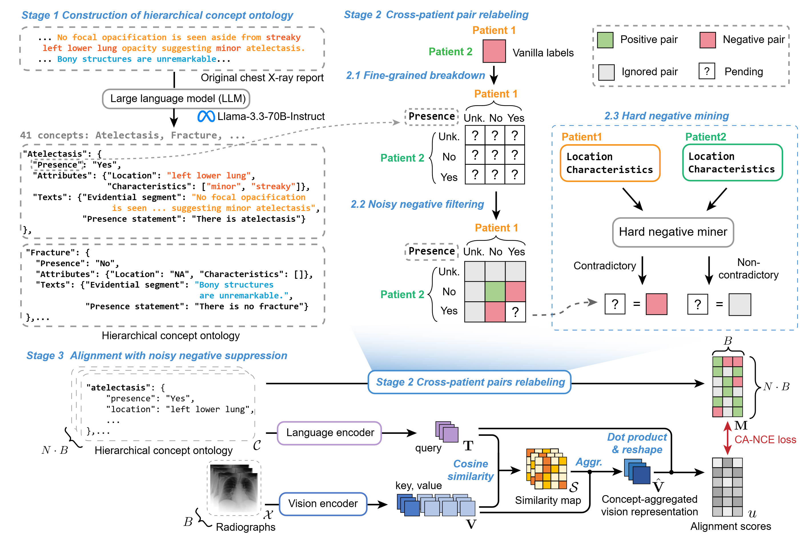

# CoNNS

Official code for **Concept-Guided Noisy Negative Suppression for Zero-Shot Classification and Grounding of Chest X-Ray Findings**. (Early accepted by MICCAI 2026, top 9%).



## Environment

Create the conda environment from the exported file:

```bash
conda env create -f environment.yml
conda activate conns
```

If you prefer to start from an existing environment, install the pip packages with:

```bash
pip install -r requirements.txt
```

The exported environment is named `conns`. `flash-attn` is included because the Rad-DINO encoder path uses it.

## External Weights

Place model folders and checkpoints under the repository root:

```text
external/rad-dino-maira-2/
external/BiomedVLP-CXR-BERT-specialized/
trained_models/conns.pth
```

Download the external encoders from Hugging Face. The NLI model is loaded online from `cross-encoder/nli-deberta-v3-small`.

```bash
huggingface-cli download microsoft/rad-dino-maira-2 --local-dir external/rad-dino-maira-2
huggingface-cli download microsoft/BiomedVLP-CXR-BERT-specialized --local-dir external/BiomedVLP-CXR-BERT-specialized
```

## Model Released
Download the CoNNS checkpoint from [`GoogleDrive`](https://drive.google.com/file/d/1EUo75GxJxwJgT8ipS_wOXvdCfkB_7XaH/view?usp=sharing) and save it as `trained_models/conns.pth`.

## Prepare Evaluation Data

Place ChestX-Det10 under `data/ChestX-Det10/`. Download it from:

```text
https://github.com/Deepwise-AILab/ChestX-Det10-Dataset
```

Expected ChestX-Det10 files:

```text
data/ChestX-Det10/test.json
data/ChestX-Det10/test_imgs/
```

For local debug, `data/ChestX-Det10` can be a symlink to an existing raw copy. The released scripts read only through `data/ChestX-Det10/...`.

Place the other evaluation datasets at the default paths used by the scripts:

```text
data/MS-CXR/MS_CXR_Local_Alignment_v1.1.0.csv
data/MS-CXR/preprocess/test.json
data/raw_dataset/MIMIC-CXR-JPG/files/
data/NIH-CXR/CARZero/test_list.txt
data/NIH-CXR/CARZero/chestxray14_test_text.json
data/NIH-CXR/images/
data/CheXpert/test_labels.csv
data/CheXpert/
data/Open-I/CARZero/custom.csv
data/Open-I/CARZero/openi_multi_label_text.json
data/Open-I/images/images_normalized/
data/PadChest-GR/master_table.csv
data/PadChest-GR/grounded_reports_20240819.json
data/PadChest-GR/PadChest_GR_8bit_short896/
```

You may refer to [CARZero](https://github.com/laihaoran/CARZero/) for data preparation except for PadChest-GR, which is at [BIMCV](https://bimcv.cipf.es/bimcv-projects/padchest-gr/).

For PadChest-GR evaluation helper files:

```bash
python3 data_preparation/evaluation/prepare_padchest_gr.py
```

## Reproduce Directly

To reproduce the reported results, use the provided checkpoint at `trained_models/conns.pth` and run evaluation directly as below.

## Evaluate

Run all released tasks:

```bash
bash evaluate.sh
```

Use `PYTHON=/path/to/env/bin/python` if the active shell is not already using the `conns` environment.

Run one task:

```bash
bash evaluate.sh classification_chexpert
```

## Prepare Training Data

Download MIMIC-CXR-JPG v2.1.0 from:

```text
https://physionet.org/content/mimic-cxr-jpg/2.1.0/
```

Keep the official structure under `data/raw_dataset/MIMIC-CXR-JPG/`, including `files/p10 ... files/p19`, `mimic-cxr-2.0.0-metadata.csv.gz`, and `mimic-cxr-2.0.0-split.csv.gz`.

The repository keeps CoNNS training metadata under:

```text
data/conns_training/concepts.json
data/conns_training/mimic_conns_training.csv
data/conns_training/reports_extract_concepts/
data/conns_training/yes_expressions/
data/conns_training/no_expressions/
```

Create the MIMIC CoNNS training CSV:

```bash
python3 data_preparation/training/create_mimic_conns_training.py
```

Run entity extraction with an OpenAI-compatible local LLM server:

```bash
python3 data_preparation/training/extract_entities.py \
  --input-dir data/raw_dataset/MIMIC-CXR-JPG/reports \
  --output-dir data/conns_training/reports_extract_concepts \
  --base-url http://localhost:8000/v1 \
  --model ./Llama-3.3-70B-Instruct-NVFP4 \
  --workers 16 \
  --skip-existing
```

Then verify JSON and build expression statistics:

```bash
python3 data_preparation/training/verify_extracted_json.py
python3 data_preparation/training/build_expression_stats.py
```

The extracted JSON must use the current prompt schema with `evidential_segment` and `characteristics`; older JSON files with only `analysis` need to be regenerated.

## Train

Run from the repository root:

```bash
bash train.sh
```

Use `PYTHON=/path/to/env/bin/python TORCHRUN=/path/to/env/bin/torchrun` if the active shell is not already using the `conns` environment.

## Acknowledgements

Some codes are borrowed from the amazing projects: [RadZero](https://github.com/deepnoid-ai/RadZero), [CARZero](https://github.com/laihaoran/CARZero/).
